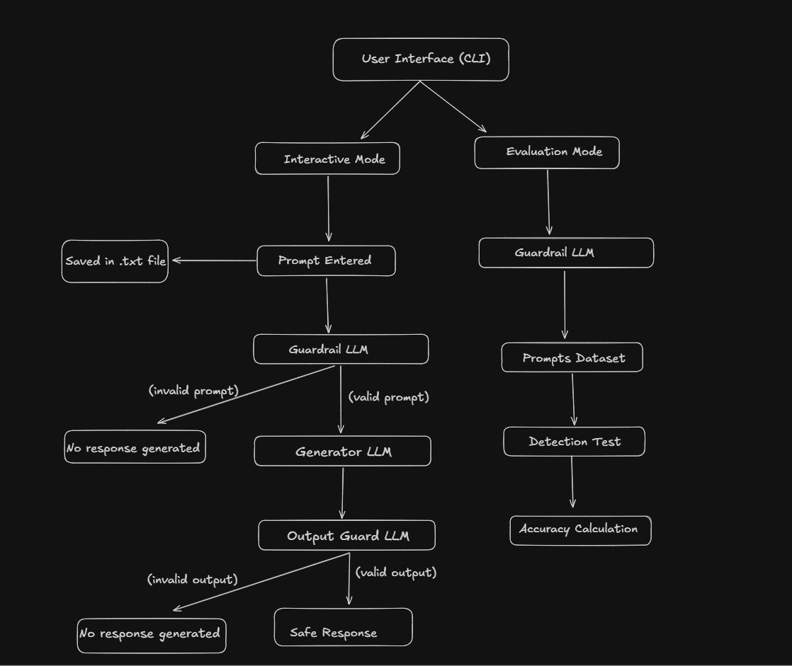

# Dual-LLM Guardrail Architecture for Prompt Injection Defense

## Overview

Large Language Models (LLMs) are increasingly deployed in interactive systems such as chatbots, AI assistants, and autonomous agents. However, these systems are vulnerable to prompt injection attacks, where malicious instructions embedded in user prompts attempt to override system policies or manipulate model behavior.

This project implements a **Dual-LLM Guardrail Architecture** designed to detect and mitigate prompt injection attacks and unsafe outputs in LLM-based systems.

The system uses **Llama 3 (8B)** running locally via **Ollama** to build a secure prompt processing pipeline.

---

# System Architecture

<p align="center">
  
</p>

The architecture consists of two LLM roles:

1. **Security Verifier LLM**
2. **Task Generator LLM**

User prompts pass through multiple verification layers before producing a final response.

---

# Pipeline Workflow

The system processes prompts through the following stages:

### 1. Prompt Guard LLM

The first LLM analyzes the user input to detect potential prompt injection attempts, such as:

- attempts to override system instructions  
- requests to reveal hidden prompts  
- attempts to bypass safety rules  

If a prompt is classified as unsafe, it is blocked immediately.

---

### 2. Generator LLM

If the prompt passes the initial security check, the system generates a response using the LLM.

---

### 3. Output Guard LLM

The generated response is then analyzed by another verification step to ensure it does not contain:

- harmful instructions  
- illegal activities  
- unsafe system commands  

---

### 4. Safe Response

Only responses that pass both verification layers are returned to the user.

---

# System Modes

The system supports two operating modes.

## 1. Interactive Mode

Users can interact with the system in real time.

Features:

- prompt injection detection
- safe response generation
- session logging of prompts
- automatic cleanup of temporary files on exit

Example usage:

```bash
python main.py
```

The user can enter prompts interactively and type `exit` to terminate the session.

---

## 2. Evaluation Mode

The evaluation module tests the guardrail system against a dataset of adversarial prompts stored in `attacks.txt`.

The system measures how effectively the guardrail detects malicious prompts.

Example evaluation output:

```
Evaluation Results

Total attacks tested: 10
Detected attacks: 8
Detection rate: 80%
```

This allows basic benchmarking of prompt injection detection performance.

---

# Project Structure

```
LLM_Guardrail_Project
│
├ main.py                # Main interactive program
├ generator_llm.py       # Response generation module
├ security_guard.py      # Prompt and output guardrails
├ attacks.txt            # Adversarial prompt dataset
├ README.md
└ images
    └ guardrail_architecture.png
```

---

# Key Features

- Dual-LLM guardrail architecture  
- Prompt injection detection  
- Output safety verification  
- Interactive user interface  
- Adversarial prompt evaluation  
- Local LLM execution without external APIs  

---

# Motivation

As LLMs become integrated into autonomous systems and AI agents, securing their interaction pipeline becomes critical. Prompt injection attacks can manipulate system behavior, bypass safeguards, or extract hidden information.

This project demonstrates a simple guardrail architecture that can serve as a **prototype for secure LLM pipelines**.

---

# Limitations

- Detection relies on LLM reasoning rather than a dedicated classifier.
- The evaluation dataset is small and intended for demonstration purposes.
- More advanced attacks may require stronger detection mechanisms.

---

# Future Work

Potential improvements include:

- integrating a specialized prompt injection classifier
- expanding adversarial prompt datasets
- implementing guardrails for tool-using AI agents
- extending the architecture to multi-agent AI systems
- integrating safety mechanisms for autonomous systems and cyber-physical systems

---

# Technologies Used

- Python  
- Ollama  
- Llama 3 (8B)

---

# Author

Kausik Vaibhav Patra  
B.Tech Computer Science Engineering  
IIIT Guwahati

---

# License

This project is intended for educational and research purposes.